<!-- Using HTML to center the abstract -->
<div class="columns is-centered has-text-centered">
    <div class="column is-four-fifths">
        <h2>Abstract</h2>
        <div class="content has-text-justified">
In the rapidly evolving domain of vision-based deep reinforcement learning (RL),
a pivotal challenge is to achieve generalization capability to dynamic environmental
changes reflected in visual observations. Our work delves into the intricacies
of this problem, identifying two key issues that appear in previous approaches
for visual RL generalization: (i) imbalanced saliency and (ii) observational
overfitting. Imbalanced saliency is a phenomenon where an RL agent
disproportionately identifies salient features across consecutive frames in a frame
stack. Observational overfitting occurs when the agent focuses on certain background
regions rather than task-relevant objects. To address these challenges, we
present a simple yet effective framework for generalization in visual RL (SimGRL)
under dynamic scene perturbations. First, to mitigate the imbalanced saliency
problem, we introduce an architectural modification to the image encoder to
stack frames at the feature level rather than the image level. Simultaneously,
to alleviate the observational overfitting problem, we propose a novel technique
called shifted random overlay augmentation, which is specifically designed
to learn robust representations capable of effectively handling dynamic visual
scenes. Extensive experiments demonstrate the superior generalization capability
of SimGRL, achieving state-of-the-art performance in benchmarks including the
DeepMind Control Suite.
        </div>
    </div>
</div>

---

## Motivation
<p align="center">
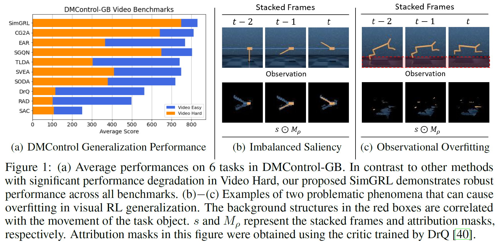
</p>

Using a gradient-based attribution mask, we investigate the causes of the degradation in generalization in challenging environments by examining salient regions across consecutive stacked frames used as an RL input. Based on our analysis, we empirically identified two phenomena, highlighting them as key causes of performance degradation: (i) what we refer to as imbalanced saliency and (ii) observational overfitting [1].

## Method
*__1. Feature-Level Frame Stack__*

To alleviate the imbalanced saliency problem, we modify the encoder structure from an image-level frame stack to a feature-level frame stack.

<p align="center">
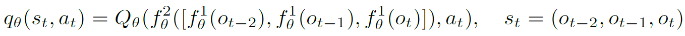
</p>

*__2. Shifted Random Overlay Augmentation__*

To alleviate the observational overfitting problem and make the encoder robust to dynamic backgrounds, we propose a new data augmentation called shifted random overlay.

<p align="center">
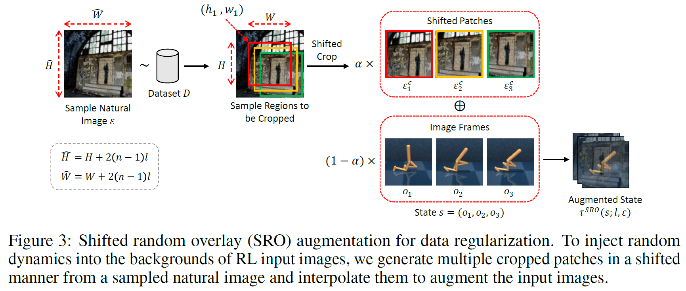
</p>

*__SimGRL__*

Based on SVEA [2] as a baseline algorithm, we propose SimGRL by adopting the two regularizations.

<p align="center">
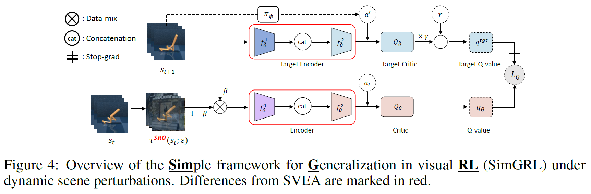
</p>

<p align="center">
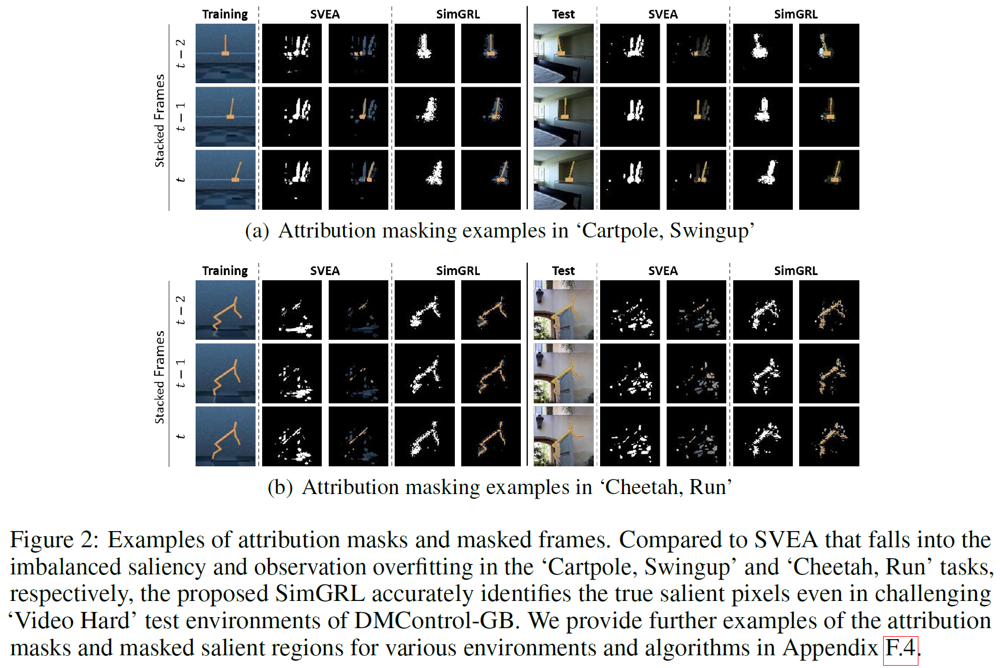
</p>

## Results
*__DMControl-GB__*

<p align="center">
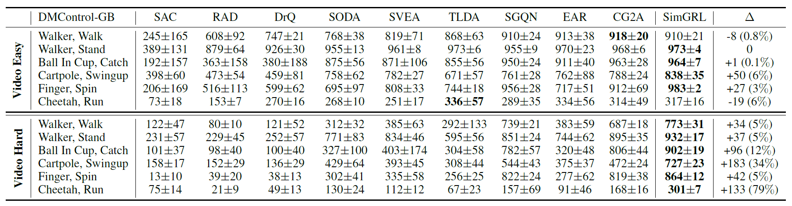
</p>

<p align="center">
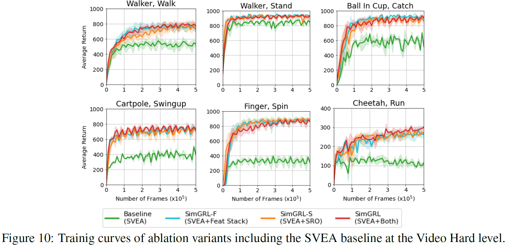
</p>

*__DistractingCS__*

<p align="center">
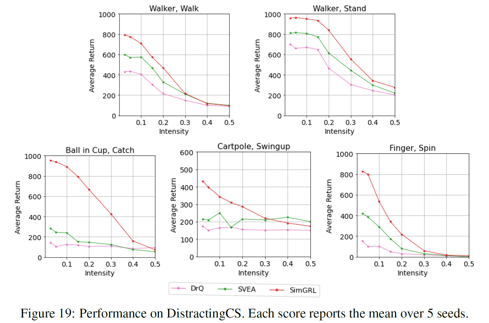
</p>

*__Robotic Manipulation__*

<p align="center">

</p>

## Demonstrations
*__DMControl-GB__*
<p align="center">

    &nbsp;

    &nbsp;


&nbsp;&nbsp;&nbsp;&nbsp;&nbsp;&nbsp;&nbsp;&nbsp;&nbsp;&nbsp;&nbsp;&nbsp;
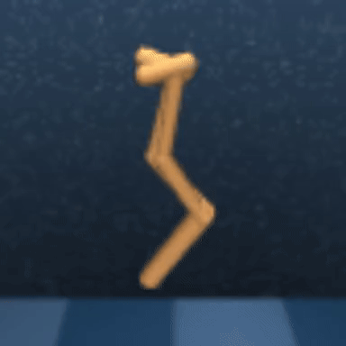


</p>

<p align="center">
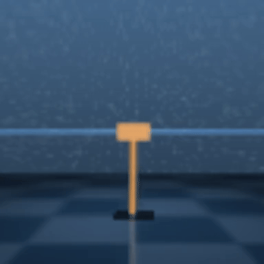
    &nbsp;

    &nbsp;


&nbsp;&nbsp;&nbsp;&nbsp;&nbsp;&nbsp;&nbsp;&nbsp;&nbsp;&nbsp;&nbsp;&nbsp;
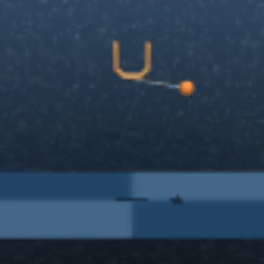


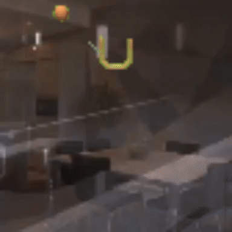
</p>

<p align="center">

    &nbsp;

    &nbsp;


&nbsp;&nbsp;&nbsp;&nbsp;&nbsp;&nbsp;&nbsp;&nbsp;&nbsp;&nbsp;&nbsp;&nbsp;
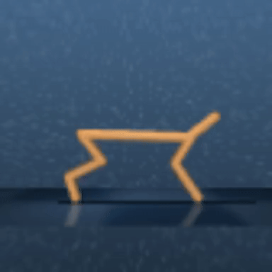


</p>

*__DistractingCS__*

Each test shows the results for intensity levels $\in$ {0.05, 0.1, 0.15, 0.2, 0.3}.

<p align="center">

&nbsp;

&nbsp;

&nbsp;

&nbsp;

&nbsp;

&nbsp;

</p>

<p align="center">
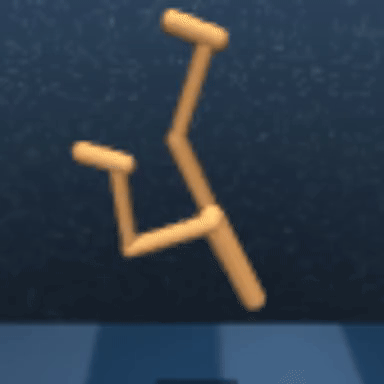
&nbsp;

&nbsp;

&nbsp;

&nbsp;

&nbsp;

&nbsp;

</p>

<p align="center">
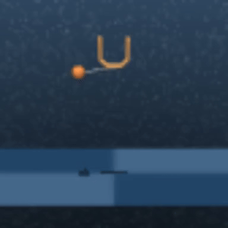
&nbsp;

&nbsp;

&nbsp;

&nbsp;

&nbsp;

&nbsp;

</p>

<p align="center">

&nbsp;

&nbsp;

&nbsp;

&nbsp;

&nbsp;

&nbsp;

</p>

<p align="center">
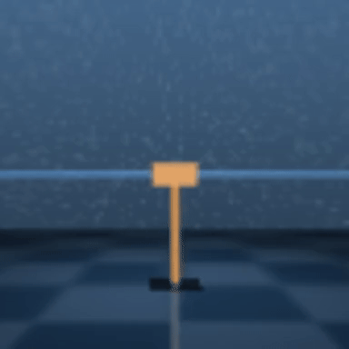
&nbsp;

&nbsp;
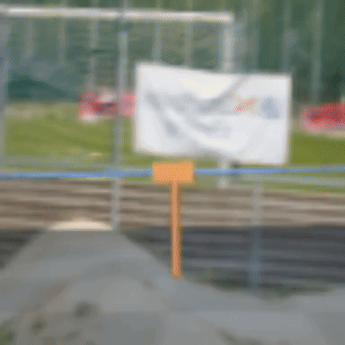
&nbsp;

&nbsp;

&nbsp;
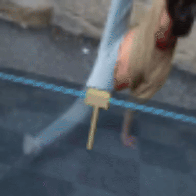
&nbsp;
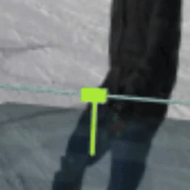
</p>


*__Robotic Manipulation__*

<p align="center">
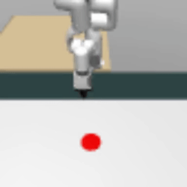
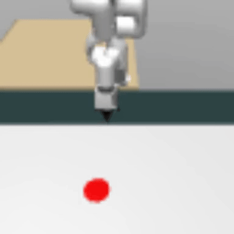
&nbsp;

&nbsp;
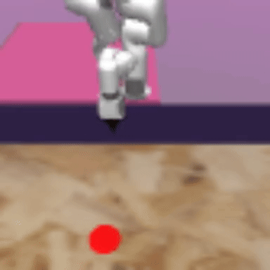
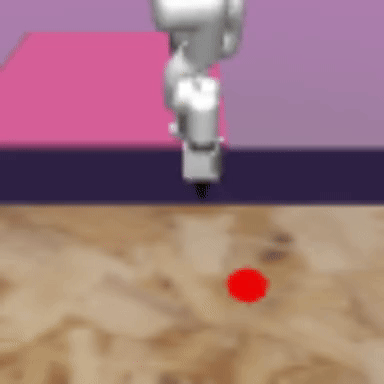
&nbsp;&nbsp;
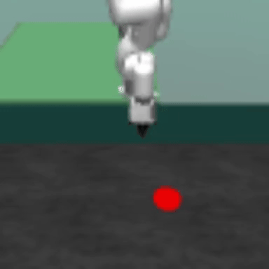
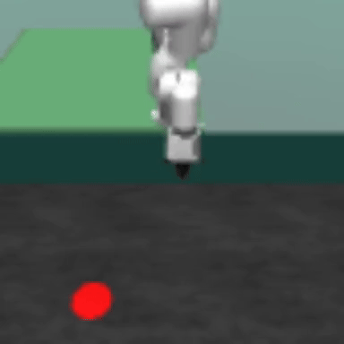
&nbsp;&nbsp;
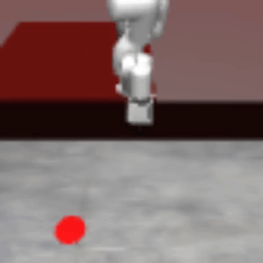
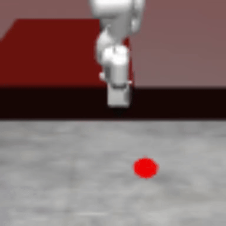
</p>

<p align="center">
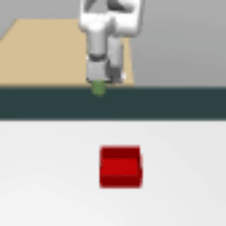
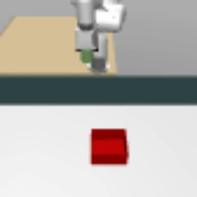
&nbsp;

&nbsp;

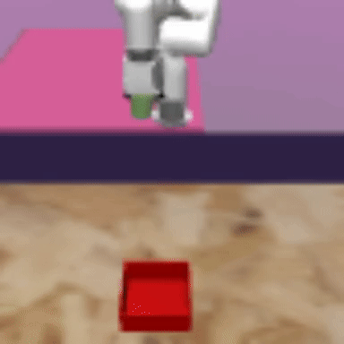
&nbsp;&nbsp;
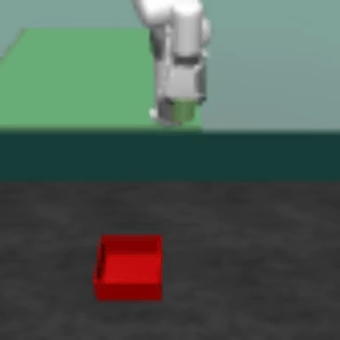
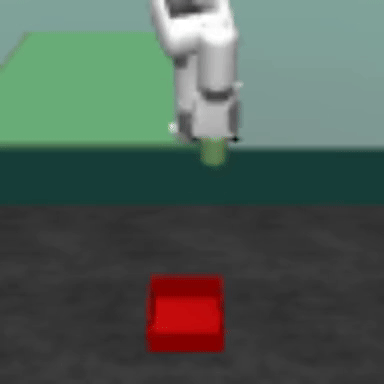
&nbsp;&nbsp;
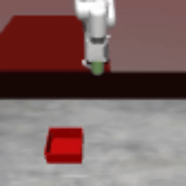
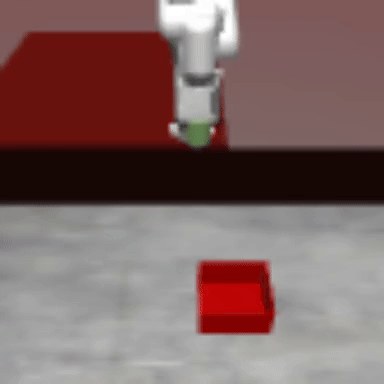
</p>

## Reference

[1] Song et al. “Observational Overfitting in Reinforcement Learning.” ICLR (2020).

[2] Hansen et al. “Stabilizing deep q-learning with convnets and vision transformers under data augmentation.” NeurIPS (2021).


## Citation
```
@inproceedings{
song2024a,
title={A Simple Framework for Generalization in Visual {RL} under Dynamic Scene Perturbations},
author={Wonil Song and Hyesong Choi and Kwanghoon Sohn and Dongbo Min},
booktitle={The Thirty-eighth Annual Conference on Neural Information Processing Systems},
year={2024},
url={https://openreview.net/forum?id=0AumdfLzpK}
}
```
