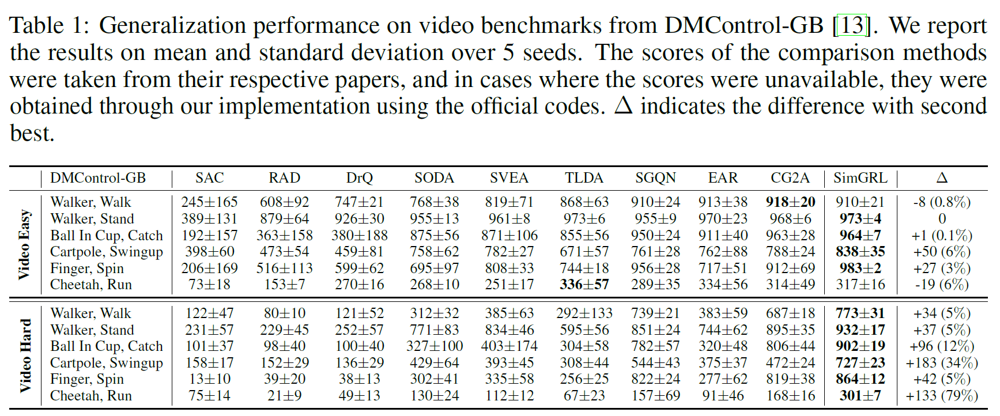
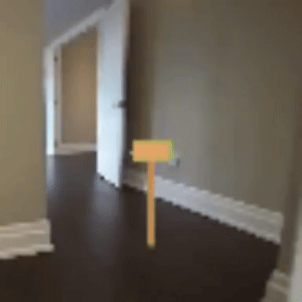
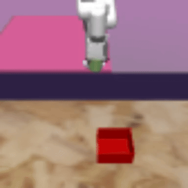

<!-- Using HTML to center the abstract -->
<div class="columns is-centered has-text-centered">
    <div class="column is-four-fifths">
        <h2>Abstract</h2>
        <div class="content has-text-justified">
In the rapidly evolving domain of vision-based deep reinforcement learning (RL),
a pivotal challenge is to achieve generalization capability to dynamic environmental
changes reflected in visual observations. Our work delves into the intricacies
of this problem, identifying two key issues that appear in previous approaches
for visual RL generalization: (i) imbalanced saliency and (ii) observational
overfitting. Imbalanced saliency is a phenomenon where an RL agent
disproportionately identifies salient features across consecutive frames in a frame
stack. Observational overfitting occurs when the agent focuses on certain background
regions rather than task-relevant objects. To address these challenges, we
present a simple yet effective framework for generalization in visual RL (SimGRL)
under dynamic scene perturbations. First, to mitigate the imbalanced saliency
problem, we introduce an architectural modification to the image encoder to
stack frames at the feature level rather than the image level. Simultaneously,
to alleviate the observational overfitting problem, we propose a novel technique
called shifted random overlay augmentation, which is specifically designed
to learn robust representations capable of effectively handling dynamic visual
scenes. Extensive experiments demonstrate the superior generalization capability
of SimGRL, achieving state-of-the-art performance in benchmarks including the
DeepMind Control Suite.
        </div>
    </div>
</div>

---

## Motivation
<p align="center">

</p>

## Overview
TBD

<p align="center">

</p>

*Figure 1: Overview.*

## Results
DMControl-GB

<p align="center">

</p>

## Demonstrations
TBD
<p align="center">


&nbsp;&nbsp;&nbsp;&nbsp;&nbsp;&nbsp;&nbsp;&nbsp;


</p>

<p align="center">




&nbsp;&nbsp;&nbsp;&nbsp;&nbsp;&nbsp;&nbsp;&nbsp;


</p>

<p align="center">


&nbsp;&nbsp;&nbsp;&nbsp;&nbsp;&nbsp;&nbsp;&nbsp;


</p>

Robotic Manipulation

<p align="center">


&nbsp;

&nbsp;


&nbsp;&nbsp;


&nbsp;&nbsp;


</p>

<p align="center">


&nbsp;

&nbsp;


&nbsp;&nbsp;


&nbsp;&nbsp;


</p>


## Citation
```
@inproceedings{
anonymous2024a,
title={A Simple Framework for Generalization in Visual {RL} under Dynamic Scene Perturbations},
author={Anonymous},
booktitle={The Thirty-eighth Annual Conference on Neural Information Processing Systems},
year={2024},
url={https://openreview.net/forum?id=0AumdfLzpK}
}
```
